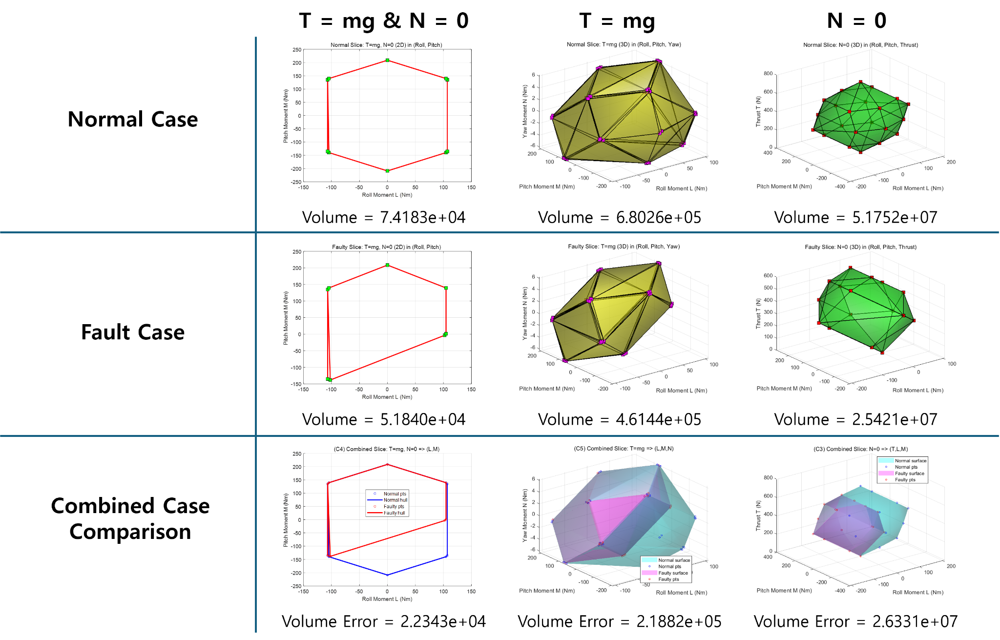
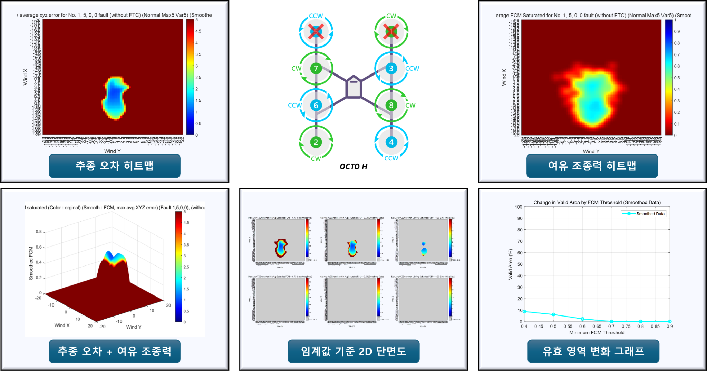
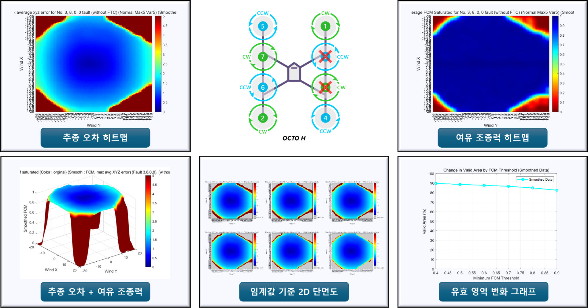

# PX4–ROS Simulation Testbed

> An integrated SIL/HIL validation environment for multirotor fault injection,
> wind-disturbance testing, motor fault testing, attainable control set(ACS) analysis, and safety-performance
> evaluation.

PX4, Gazebo, ROS/MAVLink, MATLAB/Simulink을 연동하여 멀티로터의 고장·외란
조건을 생성하고, 비행 성능을 평가하기 위한 Test automation testbed입니다.

## What This Testbed Demonstrates

- Automated execution of SILS test scenarios
- Motor-fault and wind-disturbance injection
- PX4–ROS–MATLAB/Simulink data exchange
- Flight performance evaluation
- Safety-performance envelope visualization
- HIL and motion-capture-based indoor flight experiments

## SILS System Architecture

<p align="center">
  
</p>

This testbed conducted evaluations based on PX4, Gazebo, ROS/MAVLink, QGroundControl, and MATLAB/Simulink.
Operating conditions such as motor faults, wind disturbances, Controller options, and FTC activation can be
configured while flight states, control effort(or input), and tracking error are
collected for post-processing.


<p align="center">
  
</p>
<div align="center">

  #### Integrated SILS runtime environment

</div>

<!--
<p align="center">
  
</p>
-->

<p align="center">
  
</p>

## SILS Scenario Injection

### Motor Fault Injection

<p align="center">
  
</p>

Motor-fault commands are transferred through the ROS/MAVLink interface and
applied to the Gazebo. This enables repeatable tests for selected
motor failures without changing the remainder of the flight scenario.


<p align="center">
  
</p>
<div align="center">

  #### Motor-fault injection demonstration (Left: Simulink scope for evaluation)

</div>


### Wind Disturbance Injection

<p align="center">
  
</p>

Wind direction, magnitude, steady, gust, and stochastic disturbance(Turbulence) conditions are
published from ROS and applied to the simulated vehicle through the Gazebo wind
plugin.


<p align="center">
  
</p>
<div align="center">

  #### Wind-disturbance demonstration

</div>


<details>
<summary>Wind and rotor aerodynamic model</summary>

<p align="center">
  
</p>
<div align="center">

  #### Wind directions and rotor aerodynamic model

</div>

For more details, please refer to https://github.com/PX4/PX4-SITL_gazebo-classic/issues/110.

</details>


## Attainable Control Set & Safety Performance Evaluation

### Attainable Control Set (ACS)

<p align="center">
  
</p>
<div align="center">

  #### Comparison of ACS in fault and normal state

</div>


The available roll, pitch, yaw moment, and thrust domains are compared under normal and failure conditions.
The resulting geometry provides a direct view
of how a fault changes the available ACS.


### Safety-Performance Envelope

Performance and safety of the multirotor are evaluated under various failure and wind conditions.


<p align="center">
  
</p>

<details>
<summary>Comparison safety performance envelopes with various conditions</summary>

#### Single-motor fault


#### Double Motor Failures Under Different Conditions (No. 1, 5)



#### Double Motor Failures Under Different Conditions (No. 3, 8)



</details>

These comparisons indicate that the remaining feasible operating region depends
not only on the number of failed motors, but also on their geometric
configuration.

## Automated Test Selection

<p align="center">
  
</p>
<div align="center">

  #### Test efficiency strategy workflow using adaptive sampling

</div>

The evaluation workflow combines Gaussian-process prediction,
uncertainty estimation, and active sampling. The new sampling
prioritizes areas of high uncertainty, allowing for the safety
envelope with fewer simulation samples.

<p align="center">
  
</p>
<div align="center">

  #### Active sampling prediction and comparison result

</div>


## HIL & Indoor Flight Experiments

<p align="center">
  
</p>

- PX4/Pixhawk-based flight hardware
- Ground-control and telemetry monitoring
- Thrust-measurement setup
- Motion-capture-based indoor positioning
- Indoor flight demonstration and validation


<table>
  <tr>
    <td align="center">
      
    </td>
    <td align="center">
      
    </td>
    <td align="center">
      
    </td>
  </tr>
  <tr>
    <td align="center"><b>Motors 1 & 8 Fault</b></td>
    <td align="center"><b>Motors 3 & 8 Fault</b></td>
    <td align="center"><b>HIL Test Setup</b></td>
  </tr>
</table>


## Repository Guide

| Path | Purpose |
| --- | --- |
| [`PX4_testbed/`](./PX4_testbed/) | PX4/Gazebo modifications, octocopter models, and testbed-specific files |
| [`catkin_workspace`](https://github.com/Gipyo-Park/catkin_workspace) | ROS packages for control, communication, wind commands, and PX4 data bridging |


## Documentation

- [SILS and scenario injection](./docs/sils.md)
- [Performance and control-authority evaluation](./docs/performance-evaluation.md)
- [HIL and indoor flight experiments](./docs/hil-indoor-flight.md)
- [PX4 testbed directory guide](./PX4_testbed/README.md)
- [ROS workspace package guide](https://github.com/Gipyo-Park/catkin_workspace)

## Clone with Submodules

```bash
git clone --recurse-submodules \
  https://github.com/Gipyo-Park/px4-ros-simulation-testbed.git
```

If the repository has already been cloned:

```bash
git submodule update --init --recursive
```

## Core Technologies

`PX4` `Pixhawk` `ROS` `Gazebo Classic` `MAVLink` `MAVROS`  
`MATLAB` `Simulink` `C++` `Python` `QGroundControl` `Ubuntu`

## Acknowledgements

This repository integrates and modifies components from the
[PX4 Autopilot](https://github.com/PX4/PX4-Autopilot),
[MAVROS](https://github.com/mavlink/mavros),
[MAVLink](https://github.com/mavlink/mavlink), and
[Gazebo ROS packages](https://github.com/ros-simulation/gazebo_ros_pkgs)
ecosystems. Refer to each upstream project for its original license and
documentation.
