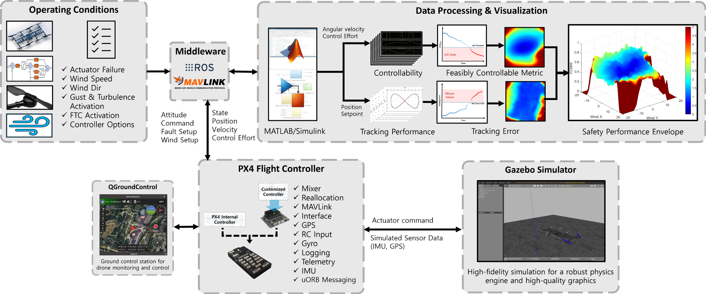
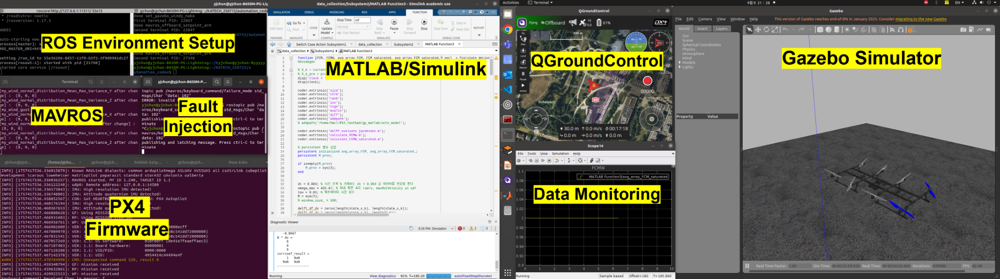
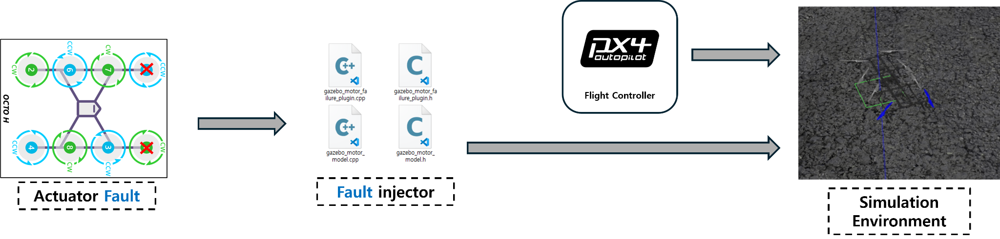
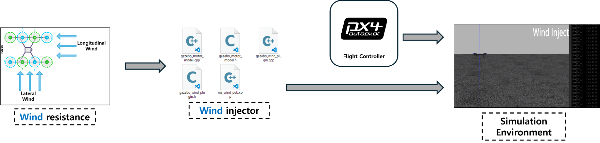
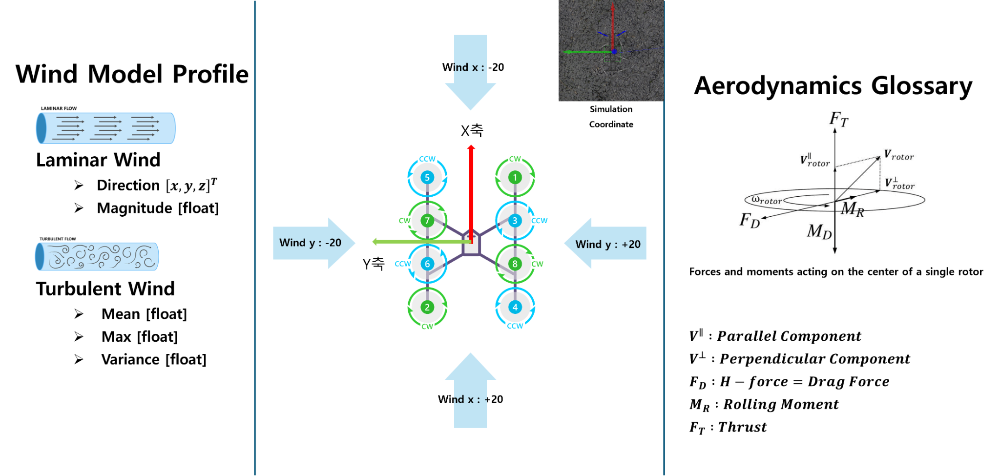
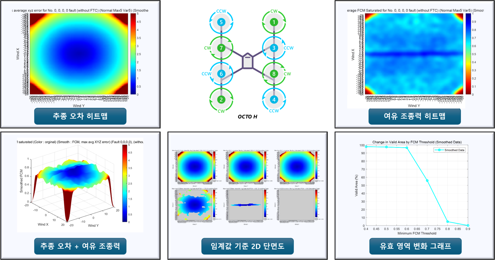
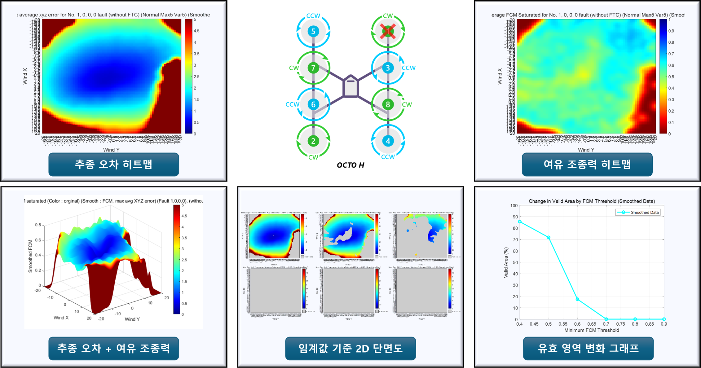
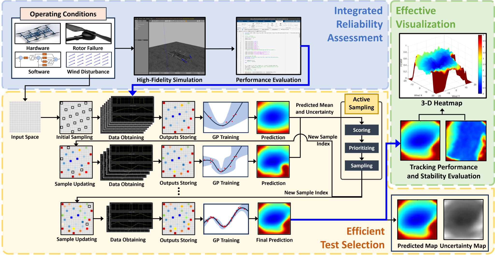
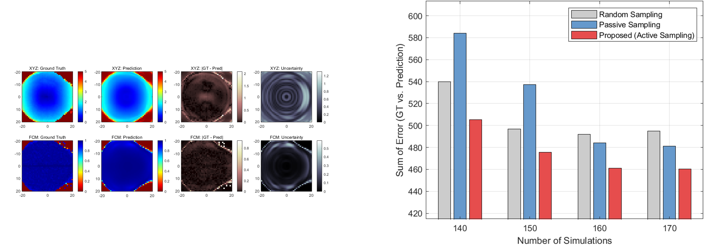
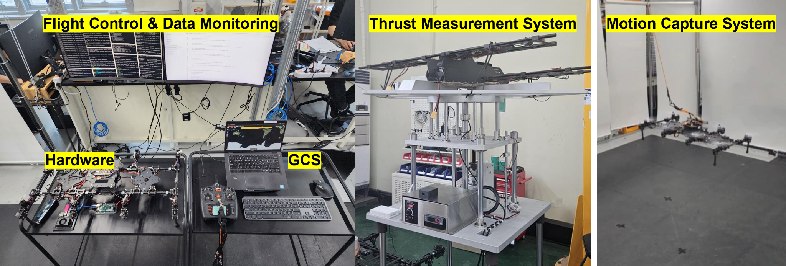

# PX4–ROS Simulation Testbed

> An integrated SIL/HIL validation environment for multirotor fault injection,
> wind-disturbance testing, motor fault testing, attainable control set(ACS) analysis, and safety-performance
> evaluation.

PX4, Gazebo, ROS/MAVLink, MATLAB/Simulink을 연동하여 멀티로터의 고장·외란
조건을 생성하고, 비행 성능을 평가하기 위한 Test automation testbed입니다.

## What This Testbed Demonstrates

- Automated execution of SILS test scenarios
- Motor-fault and wind-disturbance injection
- PX4–ROS–MATLAB/Simulink data exchange
- Flight performance evaluation
- Safety-performance envelope visualization
- HIL and motion-capture-based indoor flight experiments

## SILS System Architecture

<p align="center">
  
</p>

This testbed conducted evaluations based on PX4, Gazebo, ROS/MAVLink, QGroundControl, and MATLAB/Simulink.
Operating conditions such as motor faults, wind disturbances, Controller options, and FTC activation can be
configured while flight states, control effort(or input), and tracking error are
collected for post-processing.

<p align="center">
  
</p>

<p align="center">

  Integrated SILS runtime environment
</p>

<!--
<p align="center">
  
</p>
-->

<p align="center">
  
</p>

## SILS Scenario Injection

### Motor Fault Injection

<p align="center">
  
</p>

Motor-fault commands are transferred through the ROS/MAVLink interface and
applied to the Gazebo motor model. This enables repeatable tests for selected
motor failures without changing the remainder of the flight scenario.


<p align="center">
  
</p>


### Wind Disturbance Injection

<p align="center">
  
</p>

Wind direction, magnitude, gust, and stochastic disturbance conditions are
published from ROS and applied to the simulated vehicle through the Gazebo wind
plugin.


<p align="center">
  
</p>


<details>
<summary>Wind and rotor aerodynamic model</summary>

<p align="center">
  
</p>

</details>

## Control Authority & Performance Evaluation

### Control Allocation Space

<p align="center">
  
</p>

Nominal and faulty actuator configurations are compared in the roll, pitch,
yaw-moment, and thrust domains. The resulting geometry provides a direct view
of how a fault changes the available control-authority envelope.

### Safety-Performance Envelope

Tracking error and feasible control margin are evaluated over a wind-condition
grid. The resulting maps show where the vehicle can maintain the required
tracking and control performance.

<p align="center">
  
</p>

<details>
<summary>Compare fault-condition envelopes</summary>

#### Single-motor fault



#### Critical double-motor fault


#### Fault-tolerant double-motor configuration


</details>

These comparisons indicate that the remaining feasible operating region depends
not only on the number of failed motors, but also on their geometric
configuration.

## Automated Test Selection

<p align="center">
  
</p>

The evaluation workflow combines simulation data, Gaussian-process prediction,
uncertainty estimation, and active sampling. New operating conditions are
prioritized from the predicted response and uncertainty maps so that the safety
envelope can be estimated with fewer simulation cases.

<p align="center">
  
</p>

## HIL & Indoor Flight Experiments

<p align="center">
  
</p>

- PX4/Pixhawk-based flight hardware
- Ground-control and telemetry monitoring
- Thrust-measurement setup
- Motion-capture-based indoor positioning
- Indoor flight demonstration and data collection

This section presents the experimental environment and flight demonstrations.
Detailed quantitative results are intentionally separated from the repository
overview.


<table>
  <tr>
    <td align="center">
      
    </td>
    <td align="center">
      
    </td>
    <td align="center">
      
    </td>
  </tr>
  <tr>
    <td align="center"><b>Motors 1 & 8 Fault</b></td>
    <td align="center"><b>Motors 3 & 8 Fault</b></td>
    <td align="center"><b>HIL Test Setup</b></td>
  </tr>
</table>


## Repository Guide

| Path | Purpose |
| --- | --- |
| [`PX4_testbed/`](./PX4_testbed/) | PX4/Gazebo modifications, octocopter models, and testbed-specific files |
| [`catkin_workspace`](https://github.com/Gipyo-Park/catkin_workspace) | ROS packages for control, communication, wind commands, and PX4 data bridging |
| [`docs/`](./docs/) | Detailed SILS, evaluation, and HIL documentation |
| [`assets/`](./assets/) | Architecture diagrams, results, photos, and demo media |

## Engineering Scope

| Category | Scope in this repository |
| --- | --- |
| Custom | Wind-command nodes, PX4 bridge messages, data exchange, scenario configuration, evaluation and visualization |
| Modified | PX4/Gazebo motor-fault and wind components, vehicle models, and MAVROS fault-command interface |
| Integrated | PX4-Autopilot, MAVLink, MAVROS, Gazebo ROS packages, QGroundControl, and AIRo control packages |

The distinction above separates project-specific engineering work from
integrated open-source components.

## Documentation

- [SILS and scenario injection](./docs/sils.md)
- [Performance and control-authority evaluation](./docs/performance-evaluation.md)
- [HIL and indoor flight experiments](./docs/hil-indoor-flight.md)
- [PX4 testbed directory guide](./PX4_testbed/README.md)
- [ROS workspace package guide](https://github.com/Gipyo-Park/catkin_workspace)

## Clone with Submodules

```bash
git clone --recurse-submodules \
  https://github.com/Gipyo-Park/px4-ros-simulation-testbed.git
```

If the repository has already been cloned:

```bash
git submodule update --init --recursive
```

## Core Technologies

`PX4` `Pixhawk` `ROS` `Gazebo Classic` `MAVLink` `MAVROS`  
`MATLAB` `Simulink` `C++` `Python` `QGroundControl` `Ubuntu`

## Acknowledgements

This repository integrates and modifies components from the
[PX4 Autopilot](https://github.com/PX4/PX4-Autopilot),
[MAVROS](https://github.com/mavlink/mavros),
[MAVLink](https://github.com/mavlink/mavlink), and
[Gazebo ROS packages](https://github.com/ros-simulation/gazebo_ros_pkgs)
ecosystems. Refer to each upstream project for its original license and
documentation.
